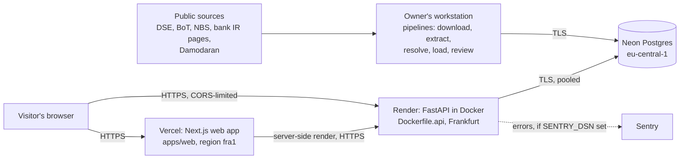

# Production architecture

Decided 2026-09-25 after checking current provider limits (sources at the end). Chosen to fit the code
that exists with the least redesign. Status of each part: `docs/PRODUCTION_CERTIFICATION.md`.

## The parts

| Part | Where | Why this choice |
|---|---|---|
| Web app | Vercel (already deployed as a protected preview) | Built for Next.js; free tier fits; deployment protection keeps drafts private |
| API | Render, Docker, `render.yaml` | Runs a long-lived Python process from the existing Dockerfile; deploys only after CI passes (`autoDeployTrigger: checksPass`); Frankfurt is the region closest to both Tanzania and Vercel's fra1 |
| Database | Neon Postgres | Free tier does not expire (0.5 GB against a 1.3 MB database); scales to zero and wakes in about 350 ms. Render's free Postgres was rejected: it is deleted 30 days (+14) after creation |
| Extraction pipelines | The owner's machine | Docling, Camelot and PyTorch are several GB and take minutes per report. They run a few times a year per bank, when new annual reports come out. They write to Neon over TLS |
| Error reporting | Sentry (optional, backend wired) | Inert until `SENTRY_DSN` is set |

## What is deliberately not here

- **No Redis and no Celery workers.** The v1 API does no background work: every request reads stored data,
  and the heaviest (a PDF) takes 0.4 s. The pipelines are commands, not jobs. The legacy Celery code
  (`apps/api/tasks`, `apps/api/core/celery_app.py`) is not used by the live API. Adding a broker and a
  worker would add two services and a failure mode for no work. Revisit when a request needs to start work
  that takes longer than a page load (for example, a user asking for a new company's report).
- **No object storage for the annual-report PDFs.** Whether our copies may be republished is an open
  question (`docs/COMPLIANCE_NOTES.md`). Until it is answered the API image does not contain them, and the
  source-file links return "missing on disk" in production.
- **No sign-in.** The site is read-only research; nothing is stored per user. Saved portfolios answer 401.
  Sign-in comes with the first feature that stores something per person (docs/SECURITY_MODEL.md).

## The one gap that needs a decision: refreshing data

Nothing refreshes prices, the index or macro data on a schedule. Today it happens when someone runs the
commands. Prices are already past their 120-hour freshness limit (loaded 2026-09-20), and the site says
so. The two sensible options:

1. **A scheduled GitHub Actions workflow** running `pipelines.macro` and the price import daily. Costs
   nothing, but the Neon URL (a secret) must be stored in GitHub's encrypted secrets.
2. **A Render cron job** from the same image. Keeps the secret in one place, but Render cron jobs are a
   paid feature.

Either is small. It is the owner's call because both involve where the database password lives or money.

## Sources checked

- Render free tier limits: <https://render.com/docs/free> (web services sleep after 15 idle minutes, about a
  minute to wake; free Postgres expires after 30 days, deleted 14 days later).
- Render Blueprint spec: <https://render.com/docs/blueprint-spec> (`runtime: docker`, `healthCheckPath`,
  `autoDeployTrigger: checksPass`, `sync: false`).
- Neon plans: <https://neon.com/docs/introduction/plans> (0.5 GB storage, 100 CU-hours/month, scale to zero
  after 5 minutes, 6 hours of instant restore on Free).
