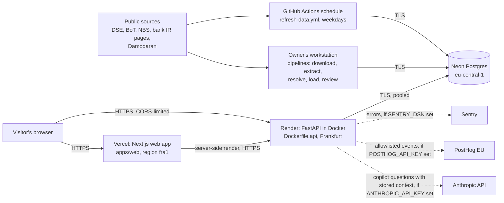

# Production architecture

Decided 2026-09-25, re-checked 2026-10-07, after checking current provider limits (sources at the end). Chosen to fit the code
that exists with the least redesign. Status of each part: `docs/PRODUCTION_CERTIFICATION.md`.

```mermaid
flowchart LR
  U[Visitor's browser] -->|HTTPS| V[Vercel: Next.js web app<br/>apps/web, region fra1]
  V -->|server-side render, HTTPS| R[Render: FastAPI in Docker<br/>Dockerfile.api, Frankfurt]
  U -->|HTTPS, CORS-limited| R
  R -->|TLS, pooled| N[(Neon Postgres<br/>eu-central-1)]
  W[Owner's workstation<br/>pipelines: download, extract,<br/>resolve, load, review] -->|TLS| N
  S[Public sources<br/>DSE, BoT, NBS, bank IR pages,<br/>Damodaran] --> W
  G[GitHub Actions schedule<br/>refresh-data.yml, weekdays] -->|TLS| N
  S --> G
  R -. errors, if SENTRY_DSN set .-> E[Sentry]
  R -. allowlisted events, if POSTHOG_API_KEY set .-> P[PostHog EU]
  R -. copilot questions with stored context, if ANTHROPIC_API_KEY set .-> A[Anthropic API]
```

Signed-in requests go browser → Vercel route handler → API, never browser → API directly: the session token
stays in an httpOnly cookie on the web app's domain. The web server passes the visitor's address with
`INTERNAL_PROXY_SECRET` so the API can rate-limit per visitor (`docs/SECURITY_MODEL.md`).

## The parts

| Part | Where | Why this choice |
|---|---|---|
| Web app | Vercel (already deployed as a protected preview) | Built for Next.js; free tier fits; deployment protection keeps drafts private |
| API | Render, Docker, `render.yaml` | Runs a long-lived Python process from the existing Dockerfile; deploys only after CI passes (`autoDeployTrigger: checksPass`); Frankfurt is the region closest to both Tanzania and Vercel's fra1 |
| Database | Neon Postgres | Free tier does not expire (0.5 GB against a 1.3 MB database); scales to zero and wakes in about 350 ms. Render's free Postgres was rejected: it is deleted 30 days (+14) after creation |
| Extraction pipelines | The owner's machine | Docling, Camelot and PyTorch are several GB and take minutes per report. They run a few times a year per bank, when new annual reports come out. They write to Neon over TLS |
| Error reporting | Sentry (optional, API wired) | Inert until `SENTRY_DSN` is set; release = deployed commit |
| Product analytics | PostHog EU (optional, API wired) | Server-side only, allowlisted events; inert until `POSTHOG_API_KEY` is set (`docs/OBSERVABILITY.md`) |
| Research copilot | Anthropic API (`claude-opus-5-5`), called by the API | Only provider call in the system; answers grounded in stored data and checked before shown; `AI_UNAVAILABLE` without a key |
| Scheduled refresh | GitHub Actions | Free; no extra service; writes through `PRODUCTION_DATABASE_URL` |

## What is deliberately not here

- **No Redis and no Celery workers** (re-checked 2026-10-07 after the research engine, portfolio analytics and
  the copilot were added). Every request reads stored data and finishes within a page load: a PDF about 0.4 s,
  a research run (ten stages over stored data) under a second, portfolio risk under a second; the copilot
  is one provider call bounded by its own timeout, with no queue needed at 20 questions per account per day. The pipelines are commands, not jobs. The legacy Celery code
  (`apps/api/tasks`, `apps/api/core/celery_app.py`) is not used by the live API. Adding a broker and a
  worker would add two services and a failure mode for no work. Revisit when a request needs to start work
  that takes longer than a page load (for example, a user asking for a new company's report).
- **No object storage for the annual-report PDFs.** Whether our copies may be republished is an open
  question (`docs/COMPLIANCE_NOTES.md`). Until it is answered the API image does not contain them, and the
  source-file links return "missing on disk" in production.
- **No separate auth service.** Sign-in lives in the API (Argon2id, hashed session tokens) and the web app
  keeps the token in an httpOnly cookie (docs/SECURITY_MODEL.md). No third-party account was needed.

## Refreshing data

Chosen 2026-10-02: a **GitHub Actions schedule** (`.github/workflows/refresh-data.yml`), weekdays at 18:00 in
Dar es Salaam: the last 30 days of prices for every share already loaded (`pipelines.dse.refresh_prices`),
the DSE index from the day after the last stored level, and the macro inputs. Every import **merges**: new
days are added, nothing stored is deleted, and a changed past close is held for review and fails the run
(`pipelines/dse/merge.py`, `tests/v1/test_refresh_preserves_history.py`). A source outage fails the run and
is shown on `/health`. It costs nothing and needs no extra service. The database password is a secret of the
`production` environment, which the owner adds; until then every run stops at its first step with a notice.
GitHub runs schedules only from the default branch (`master`), so it also waits on `master` being updated.
A Render cron job was the alternative and is a paid feature.

## Sources checked

- Render free tier limits: <https://render.com/docs/free> (web services sleep after 15 idle minutes, about a
  minute to wake; free Postgres expires after 30 days, deleted 14 days later).
- Render Blueprint spec: <https://render.com/docs/blueprint-spec> (`runtime: docker`, `healthCheckPath`,
  `autoDeployTrigger: checksPass`, `sync: false`).
- Neon plans: <https://neon.com/docs/introduction/plans> (0.5 GB storage, 100 CU-hours/month, scale to zero
  after 5 minutes, 6 hours of instant restore on Free).
